# tech210_virtualisation
tech210_virtualisation
- Testing Local to GitHub to Jenkins using a webhook
- Testing if job merges!!!
# Dev ops and Developments

## DevOps

cloud - secure data centers that sell their own data space and services to offer security and variety on the cloud.
On premise - all datat is managed by the company 

aspects you want to improve as a DevOps engineer:

- Ease of use - Other teams are going to use the tools we create. They won't use them if they aren't user friendly - If the devs do not use our tools then there will be headaches/delays in deployment down the line.

- Flexibility - It can be easy to get locked into using a specific product, tool or software. And it then becomes hard for the company to keep up with industry changes - Everything the company uses should be easily changed or updated as the business needs change

- Robustness - We need as close to 100% uptime as possible for our company's service - We are responsible for achieving this as DevOps engineers

- Cost - Cost is often overlooked. We need to make sure the company is being as efficient as possible in its tech design - Foe example how powerful a machine do we need to conduct a task? Do we need certain servers running? etc.

Risk registers are important to understand the risks the company may face and how likely they are to happen


# Dev Environments

An area where developers are able to write/run and test code. DevOps engineers create these environments for the developer teams. we prepare the applications/ extensions they need for this space. By doing this we can standardise the developer teams communication and collaboration.

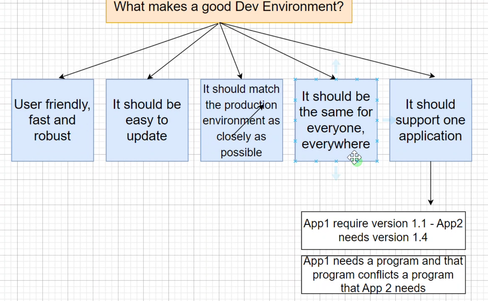

# Ruby Installation

https://rubyinstaller.org/downloads/

Once you downland the version of ruby you need, Use git bash to check the version you have using `ruby --version` (make sure to rin gitbash as administrator)

# Virtual Box Installation

https://www.virtualbox.org/wiki/Download_Old_Builds_6_1

Once you downland the version of virtual box you need, make sure to run virtual box as administrator

### Machine settings 
Make sure to check windows hypervisor platform, you can find this by  searching in your compters setting ' Turn Windows settings on or off'

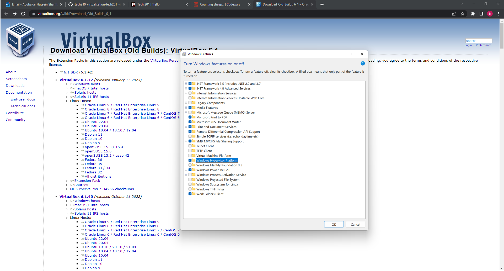

# Vagrant Installation

https://www.vagrantup.com/

Once you downland the version of vagrant you need, Use git bash to check the version you have using `vagrant --version` (make sure to rin gitbash as administrator)

Use `vagrant init ubuntu/xenia164` 

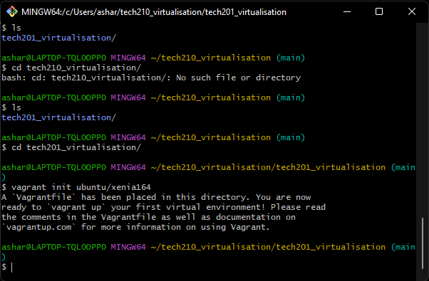

# Testing all together and Installing

The next step is to edit the rubi file you will receive in visual code. the program will have a lot of comments plastered around ,and you want to trim that down to look like this:
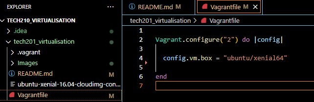

We now want to test if this works and what we must do is run `vagrant up` in our GitBash.
Should look similar to this:
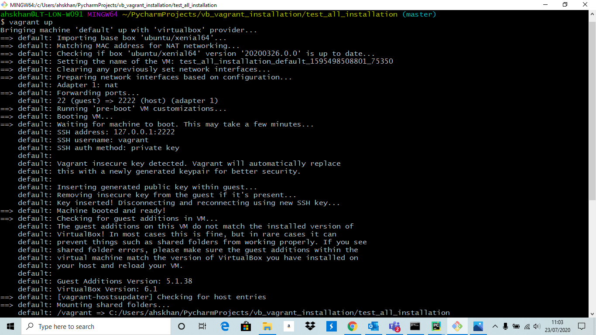
After this i would recommend checking vagrant status:
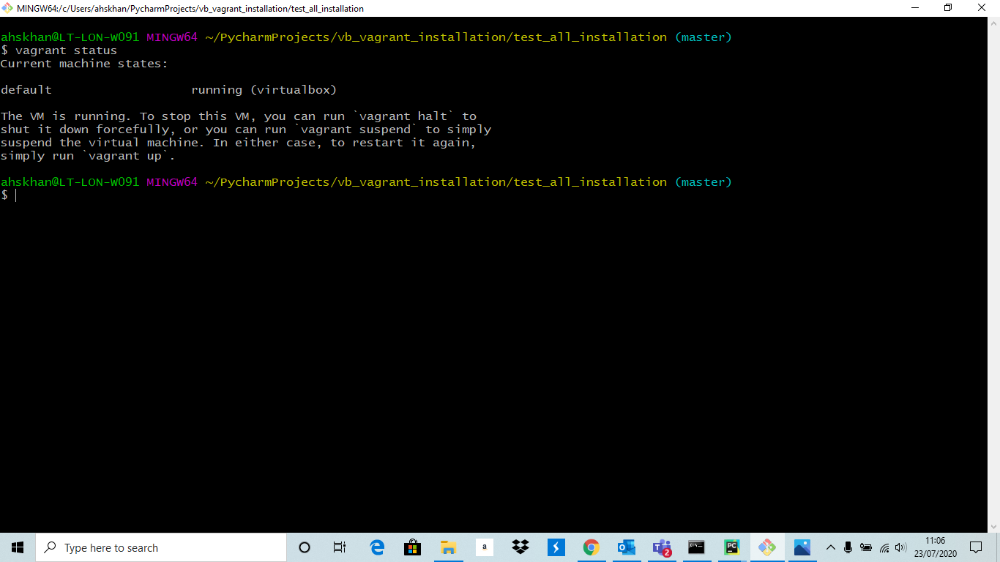

If it looks similar to this, and you have no hiccups you are now ready for the next step. if not you can refer to this installation guide below.

https://github.com/khanmaster/vb_vagrant_installtion

If all is good, we want to securely go into our VM by using `vagrant ssh` in our GitBash terminal:

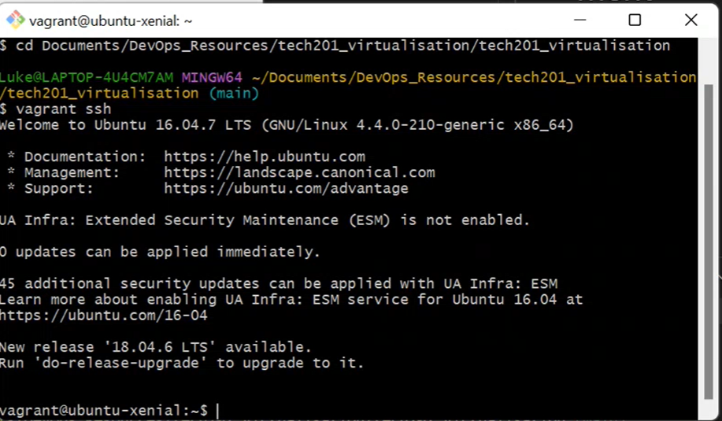

Notice how the coloured text goes ,and it now says we are in `vagrant@ubuntu-xenial:`

# Using a web server
Now that we are in our Vm use `sudo apt-get update -y` this will update all the core function in our VM. This will also confirm your Vms access to the internet

Next use `sudo apt-get install nginx -y` to install our program for our website

Finally, we want to use `sudo systemctl start nginx` and then `sudo systemctl status nginx` to run our website

Also in order to make create a fixed address ,so it's easier for developers all we have to do is add `config.vm.network "private_network", ip: "192.168.10.100"` and this goes just before the end statement.

Now just back out you vm by typing `exit` and use `vagrant reload` to reboot your Vm with the new setting

Now when you search the Ip address in your browser you should see the website we spun up which should look like this:

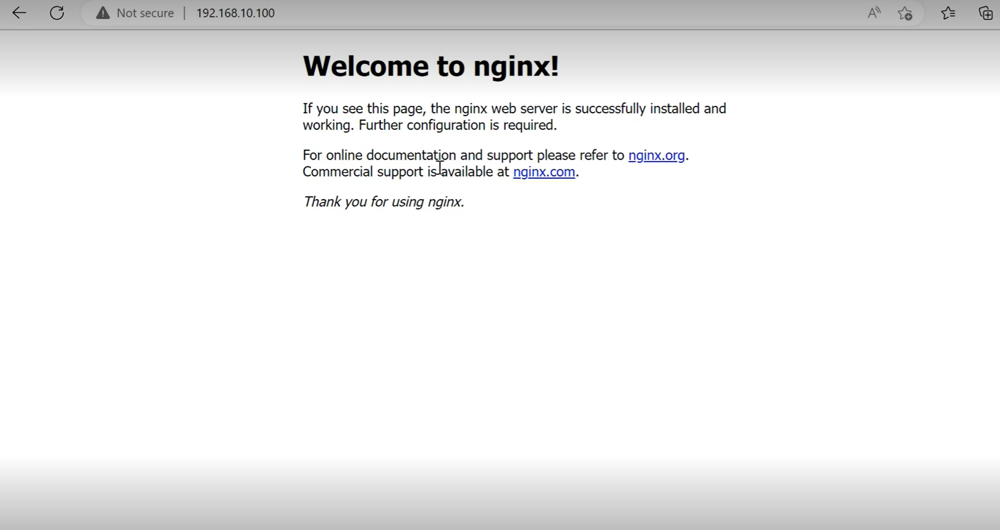


# Expanding on our Vms Application

So after completing all that we received a new task to build a similar Vm but now with an app and environment folder.
1. use `vagrant destroy` to get rid of your current vm and start new (if this doesn't work you can go into Virtual box and terminated it inside the application).
2. Now use the previous steps in order to run a new virtual machine. However, make sure to also add the app and environment files into the same folder as your vagrant file and also add `
  config.vm.synced_folder "app", "/home/vagrant/app"` to your vagrant file

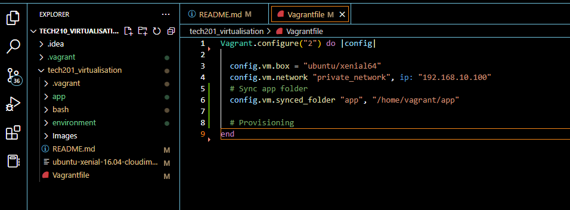

3. Using Visual studio codes bash terminal you now want to `cd environment` and `cd spec test`

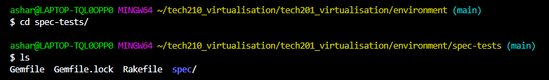

This is an example of how it should look

4. Next use `gem install bundler` and then `bundle` and now you can use `rake spec` to check if all the features needed are installed. For now, it will come back with 7 mailers because we haven't installed these packages
5. Now in our GitBash terminal (remember to ssh into Vm) we want to use `sudo apt-get update -y` and then use `sudo apt-get upgrade -y` to get all the latest versions (This can be somewhat dangerous to do in a production environment)
6. Next do `sudo apt-get install nginx -y` and `sudo systemctl enable nginx -y` or `sudo systemctl start nginx -y` to enable ngnix
7. If you do `rake spec ` again in visual code you will now see there are only 3 failures. We want to continue with `sudo apt-get install python-software-properties` this is a specific version and must be inputted as so
8. We also need a specific version on nodejs, so we want to input `curl -sL https://deb.nodesource.com/setup_6.x | sudo -E bash -` when we install nodejs we will get this version now.
9. We can now install `sudo apt-get install nodejs -y` for nodejs and jus check that with `nodejs -v` and if we now do a `rake spec` there will only be one failure left
10. All we have to do is `sudo npm install pm2 -g` to install the last package your `rake spec should now be fully done`
11. Now when we `cd app` and use `ls` we should see a couple of files

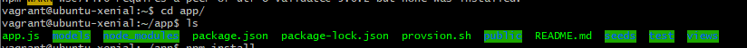

and we can use `npm install` to install the app
12. Finally, if we use `node app.js` we should receive "Your app is ready and listening on port 300" meaning we are all set up and ready to go. All that's left is to sear your `ip:3000` to see the developer site

## How to create an automated template using provisioning

It can be long to repeat these steps every time we need an environment for a developer. What we can do is create a template so every time the Vm is made it will come with everything pre-installed with the right versions.

1. You want to start by creating a file called `provision.sh`
2. Now in `provision.sh` you can create a bash script, this will make sure that evey time run `vagrant up` the cript will input command for you so that it will be ready when it starts:

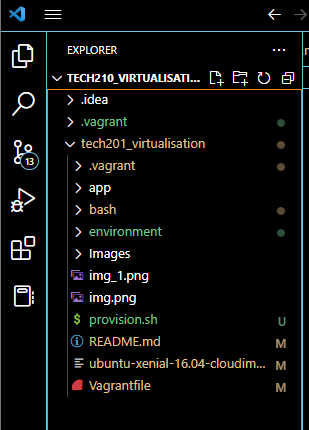

* Notice how we use `cd app` to insure we are in the app folder because this is where `app.js` resides and is what we use to launch the app

3. We also need to make sure to update this change in our vagrant file by adding ```# Provisioning
  config.vm.provision "shell", path: "provision.sh"```

and it should look something like this:

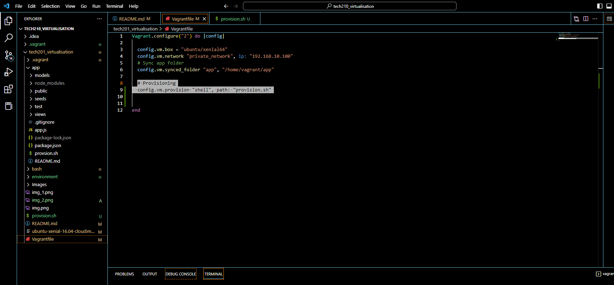

4. Now when we use `vagrant up` it should come preinstalled to the app and all you need to do is search `ip address:3000` on your web browser


# Using 2 Vm's to add a database to your application

1. You want to first start by commenting out some codes in your provisioning script so that you can make sure to connect the Vms together. Specifically `cd app` and `node app.js`
2. We now want to change our vagrant file so that it can boot up two different vms at the same time. it should look like so:

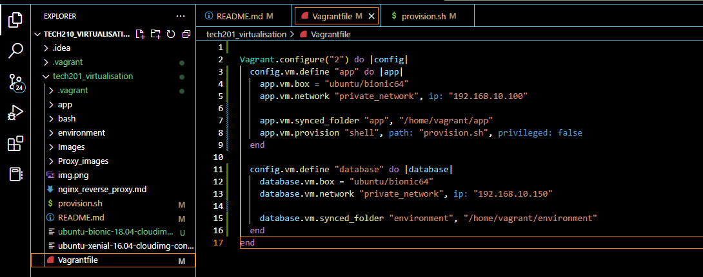

3. Now when we boot up our `vagrant up` we should see two different Vms in Virtual box.
4. We want to start by installing the database by using the key `sudo apt-key adv --keyserver hkp://keyserver.ubuntu.com:80 --recv D68FA50FEA312927`
5. To make sure it is working we need to use the command `echo "deb https://repo.mongodb.org/apt/ubuntu xenial/mongodb-org/3.2 multiverse" | sudo tee /etc/apt/sources.list.d/mongodb-org-3.2.list`

It will display back - deb https://repo.mongodb.org/apt/ubuntu xenial/mongodb-org/3.2 multiverse

6. We now need to upgrade and update the system using `sudo apt-get update -y` and `sudo apt-get upgrade -y`
7. We can now install the database using `sudo apt-get install -y mongodb-org=3.2.20 mongodb-org-server=3.2.20 mongodb-org-shell=3.2.20 mongodb-org-mongos=3.2.20 mongodb-org-tools=3.2.20` if you would like to check the status of the database this can be done using the command `sudo systemctl status mongod` this will show you if it is active or not
8. Now we want to start and enable our database using `udo systemctl start mongod` and `sudo systemctl enable mongod`

If successfully enabled, we will receive the following message in the console.

Created symlink /etc/systemd/system/multi-user.target.wants/mongod.service -> /lib/systemd/system/mongod.service.

9. We now need to change the configurations of our database to give us access. we can enter `sudo nano /etc/mongod.conf` and change `bindIP: 127.0.0.1` to `0.0.0.0` and this will basically allow access to anyone. We can now restart our database with `sudo systemctl restart mongod` and enable it with `udo systemctl enable mongod`
10. Now that we're done with our database we just need to the app Vm. We want to start by creating an environmental variable by using `export db_host=mongodb://192.168.10.150:27017/posts` and we can check that this worked by using `source .bashrc` and this will let us know if our `printenv db_host` will work.
11. Now all we have to do is cd into our app folder and do `pnm install` and `node app.js` to finish of linking the database and the app

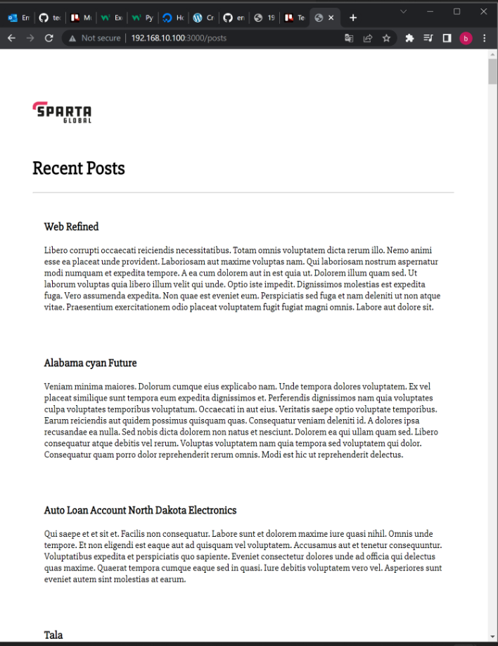

# Automate multimachine Vagrant

Stage 1

Find a way to provision the database vm in your Vagrantfile. Note the provision file for the database(db) machine needs to be separate and thus in a separate folder.

Provision it to have MongoDB after a 'vagrant up'

Get /posts working

## Created new provisioning files for app and database.

So I began by creating new directory's I can reference on my vagrant file that contain the provisioning files for the app Vm and the database vm

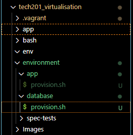

I then went on to make the script for each provisioning file.

In terms of the app:

```
#!/bin/bash

sudo apt-get update -y
sudo apt-get upgrade -y
sudo apt-get install nginx -y
sudo systemctl start nginx
sudo systemctl enable
sudo apt-get install python -y
# install nodejs
sudo apt-get install python-software-properties
curl -sL https://deb.nodesource.com/setup_12.x | sudo -E bash -
sudo apt-get install nodejs -y

# install pm2
sudo npm install pm2 -g
```

and for the database:

```
#!/bin/bash

# key installation
sudo apt-key adv --keyserver hkp://keyserver.ubuntu.com:80 --recv D68FA50FEA312927
echo "deb https://repo.mongodb.org/apt/ubuntu xenial/mongodb-org/3.2 multiverse" | sudo tee /etc/apt/sources.list.d/mongodb-org-3.2.list

# update and upgrade
sudo apt-get update -y
sudo apt-get upgrade -y

# install the db
sudo apt-get install -y mongodb-org=3.2.20 mongodb-org-server=3.2.20 mongodb-org-shell=3.2.20 mongodb-org-mongos=3.2.20 mongodb-org-tools=3.2.20

# start and enable database
sudo systemctl start mongod
sudo systemctl enable mongod
```

We also need to add some changes into our vagrant file, so that it knows where to find the script to build its Vms

```
Vagrant.configure("2") do |config|
  config.vm.define "app" do |app|
    app.vm.box = "ubuntu/bionic64"
    app.vm.network "private_network", ip: "192.168.10.100"
   
    app.vm.synced_folder "app", "/home/vagrant/app"
    app.vm.provision "shell", path: "environment/app/provision.sh", privileged: false
  end

  config.vm.define "database" do |database|
    database.vm.box = "ubuntu/bionic64"
    database.vm.network "private_network", ip: "192.168.10.150"
    
    database.vm.synced_folder "environment", "/home/vagrant/environment"
    database.vm.provision "shell", path: "environment/database/provision.sh", privileged: false
  end
end
```

Now when we do `vagrant up` the Vm will be built with the mongodb database ready to be linked the era i received here is I did /post rather than /posts, so I got this:

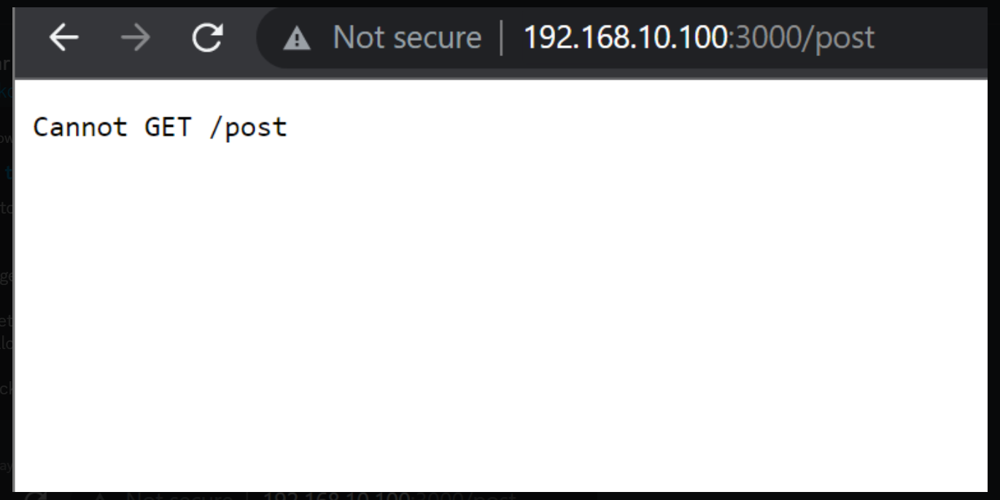


This is the correct way it should look when inputting `http://192.168.10.100:3000/posts` 

## Increasing the automation 

So now that we want to create more automation the first step would be to make it so that we can configure the ip address when building the Vm ,so we don't have to deal with any networking

Firstly, we had to change the database provisioning so that we can remove our current configuration and create a new file with our desired configurations:

```
#!/bin/bash

# key installation
sudo apt-key adv --keyserver hkp://keyserver.ubuntu.com:80 --recv D68FA50FEA312927
echo "deb https://repo.mongodb.org/apt/ubuntu xenial/mongodb-org/3.2 multiverse" | sudo tee /etc/apt/sources.list.d/mongodb-org-3.2.list

# update and upgrade
sudo apt-get update -y
sudo apt-get upgrade -y

# install the db
sudo apt-get install mongodb-org=3.2.20 -y
sudo apt-get install -y mongodb-org=3.2.20 mongodb-org-server=3.2.20 mongodb-org-shell=3.2.20 mongodb-org-mongos=3.2.20 mongodb-org-tools=3.2.20

# start and enable database
sudo systemctl start mongod
sudo systemctl enable mongod

# changing the ip
sudo rm /etc/mongod.conf
sudo cp environment/database/mongod.conf /etc/mongod.conf

# start and enable database
sudo systemctl restart mongod
sudo systemctl enable mongod
```

```
# added in 

# changing the ip
sudo rm /etc/mongod.conf # removes current configs
sudo cp environment/database/mongod.conf /etc/mongod.conf # copies one file to another

```

This will allow the new file we make to be copied into `/etc/momngod.conf`, our configuration file is within the database file and looks like this:

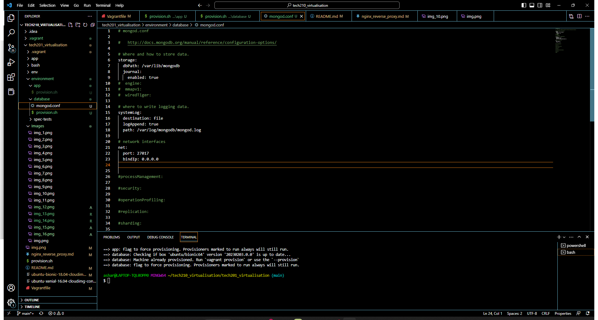

Now we can also change our application provisioning to automate our variable creation simply by adding in :

```
# creating host name variable
echo 'export DB_HOST=mongodb://192.168.10.150:27017/posts' >> ~/.bashrc
source .bashrc
```

This will make a persistent variable connecting our  DB to our app and also making sure we don't need to continually make the variable every time we load our Vms.


