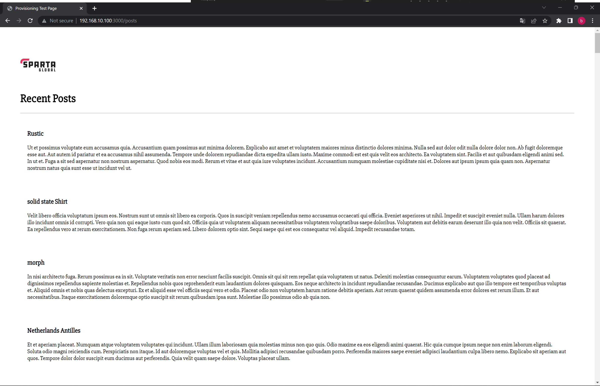

# tech210_virtualisation
tech210_virtualisation

# Dev ops and Developments

## DevOps

cloud - secure data centers that sell their own data space and services to offer security and variety on the cloud.
On premise - all datat is managed by the company 

aspects you want to improve as a DevOps engineer:

- Ease of use - Other teams are going to use the tools we create. They won't use them if they aren't user friendly - If the devs do not use our tools then there will be headaches/delays in deployment down the line.

- Flexibility - It can be easy to get locked into using a specific product, tool or software. And it then becomes hard for the company to keep up with industry changes - Everything the company uses should be easily changed or updated as the business needs change

- Robustness - We need as close to 100% uptime as possible for our company's service - We are responsible for achieving this as DevOps engineers

- Cost - Cost is often overlooked. We need to make sure the company is being as efficient as possible in its tech design - Foe example how powerful a machine do we need to conduct a task? Do we need certain servers running? etc.

Risk registers are important to understand the risks the company may face and how likely they are to happen

# Dev Environments

An area where developers are able to write/run and test code. DevOps engineers create these environments for the developer teams. we prepare the applications/ extensions they need for this space. By doing this we can standardise the developer teams communication and collaboration.

# Ruby Installation

https://rubyinstaller.org/downloads/

Once you downland the version of ruby you need, Use git bash to check the version you have using `ruby --version` (make sure to rin gitbash as administrator)

# Virtual Box Installation

https://www.virtualbox.org/wiki/Download_Old_Builds_6_1

Once you downland the version of virtual box you need, make sure to run virtual box as administrator

### Machine settings 
Make sure to check windows hypervisor platform, you can find this by  searching in your compters setting ' Turn Windows settings on or off'

# Vagrant Installation

https://www.vagrantup.com/

Once you downland the version of vagrant you need, Use git bash to check the version you have using `vagrant --version` (make sure to rin gitbash as administrator)

Use `vagrant init ubuntu/xenia164` 

# Testing all together and Installing

The next step is to edit the rubi file you will receive in visual code. the program will have a lot of comments plastered around ,and you want to trim that down to look like this:

We now want to test if this works and what we must do is run `vagrant up` in our GitBash.
Should look similar to this:

After this i would recommend checking vagrant status:

If it looks similar to this, and you have no hiccups you are now ready for the next step. if not you can refer to this installation guide below.

https://github.com/khanmaster/vb_vagrant_installtion

If all is good, we want to securely go into our VM by using `vagrant ssh` in our GitBash terminal:

Notice how the coloured text goes ,and it now says we are in `vagrant@ubuntu-xenial:`

# Using a web server
Now that we are in our Vm use `sudo apt-get update -y` this will update all the core function in our VM. This will also confirm your Vms access to the internet

Next use `sudo apt-get install nginx -y` to install our program for our website

Finally, we want to use `sudo systemctl start nginx` and then `sudo systemctl status nginx` to run our website

Also in order to make create a fixed address ,so it's easier for developers all we have to do is add `config.vm.network "private_network", ip: "192.168.10.100"` and this goes just before the end statement.

Now just back out you vm by typing `exit` and use `vagrant reload` to reboot your Vm with the new setting

Now when you search the Ip address in your browser you should see the website we spun up which should look like this:

# Expanding on our Vms Application

So after completing all that we received a new task to build a similar Vm but now with an app and environment folder.
1. use `vagrant destroy` to get rid of your current vm and start new (if this doesn't work you can go into Virtual box and terminated it inside the application).
2. Now use the previous steps in order to run a new virtual machine. However, make sure to also add the app and environment files into the same folder as your vagrant file and also add `
  config.vm.synced_folder "app", "/home/vagrant/app"` to your vagrant file

3. Using Visual studio codes bash terminal you now want to `cd environment` and `cd spec test`

This is an example of how it should look

4. Next use `gem install bundler` and then `bundle` and now you can use `rake spec` to check if all the features needed are installed. For now, it will come back with 7 mailers because we haven't installed these packages
5. Now in our GitBash terminal (remember to ssh into Vm) we want to use `sudo apt-get update -y` and then use `sudo apt-get upgrade -y` to get all the latest versions (This can be somewhat dangerous to do in a production environment)
6. Next do `sudo apt-get install nginx -y` and `sudo systemctl enable nginx -y` or `sudo systemctl start nginx -y` to enable ngnix
7. If you do `rake spec ` again in visual code you will now see there are only 3 failures. We want to continue with `sudo apt-get install python-software-properties` this is a specific version and must be inputted as so
8. We also need a specific version on nodejs, so we want to input `curl -sL https://deb.nodesource.com/setup_6.x | sudo -E bash -` when we install nodejs we will get this version now.
9. We can now install `sudo apt-get install nodejs -y` for nodejs and jus check that with `nodejs -v` and if we now do a `rake spec` there will only be one failure left
10. All we have to do is `sudo npm install pm2 -g` to install the last package your `rake spec should now be fully done`
11. Now when we `cd app` and use `ls` we should see a couple of files

and we can use `npm install` to install the app
12. Finally, if we use `node app.js` we should receive "Your app is ready and listening on port 300" meaning we are all set up and ready to go. All that's left is to sear your `ip:3000` to see the developer site