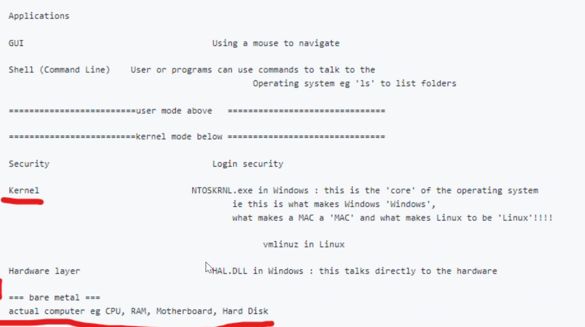
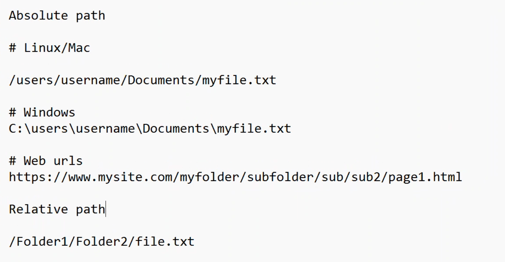
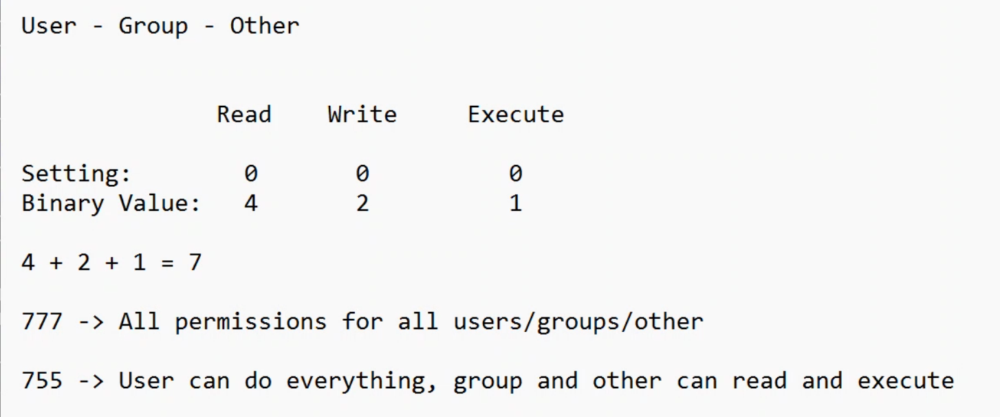
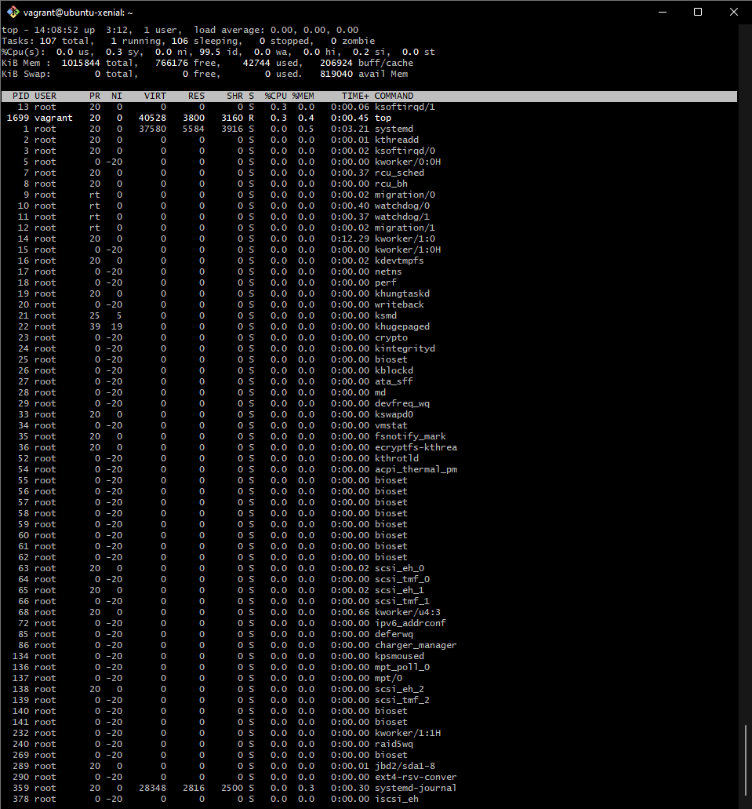
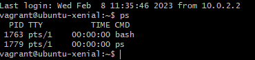
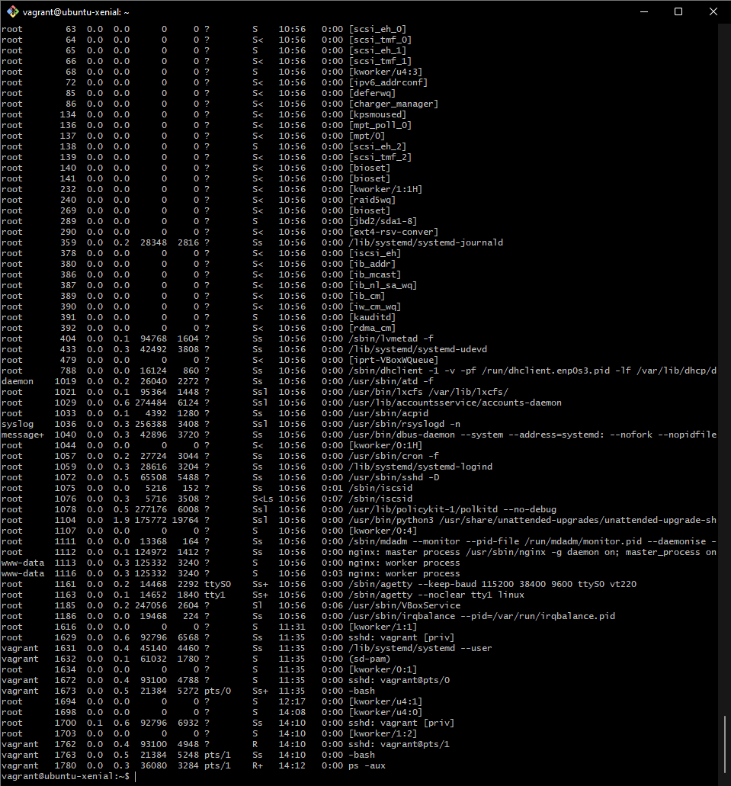

# Advanced bash

## levels of computing

```
- `uname` = username
flags = Flags are used to modify the behavior of a command.
-a = --all
-s = stuid / setuid bit and the executable bit both are set
-r = recursive option
-i = -i selects Internet files or sockets.
-o = often used to denote the name of the output file
```

```
cd = change directory - allows you to move around into different folder
cd.. = takes us back one folder
cd../../ = takes us back two directorys
cd / = back to root directory
cd ~ = back to home directory  
```

```
ls = lists files and folders in directory 
ls -l = lists files with permissions (l stand for long format)
ls 
```
Absolute path = the path to the file/folder from the base of the machine
Relative path = where is it based on the current file you are in 



### Creating files and folders

```
touch + `filename` = used to create a file
nano + `filename` = used to make a file and allows you to open files so uou may edit it
cat + `file name` = return content of a file
mkdir + `name` = used to create a directory
```

```
cp + `name` + `name of reciving file` = used to copy files into other files
cp -rf `folder frome `folder receiving` = copy the content of a folder into another folder (f = force - forcing the copy even if its in use) (r =  recursive - everything within the folder will be affected)
rsync -r + `folder we want to sync with` + `floder we are snycing up` = allows us to sync 2 differnt folders
```
```
mv + `file name` + `folder you're moving to` = allows you to move files (if the folder you're moving to is further down just add `../` before folder destination
```
```
rm + `filename` = delete file
rm -rf + `folder` = delets folder
```
Removing files can be dangerous as it doesn't do a stop check and will delete straight away

```
pwd = shows your current directory you are in 
-help = will show you the commands and explain how they are used
man ls = manual
mand -k `` = will allow you to specify what you are looking for in the manual 
grep ` ` = used to search/ filter inputed text
grep * =search for a pattern in all files in the current directory.
ls f* =example of a wildcard that allows you to search for any file/folder that contains the secifeid letter (in thid example i used f)
```
sudo - superuser do

chmod - change permissions 

chmod settings:

linux permissions:
```
r = Read = you may view the contents of the file
w = Write = you may change the contents of the file
x = Execute = you may execute or run the file if it is a program or script
```



Owner(u-user) - Group(g-group) - Other/All(o-other)

`+` = add permissions

`-` = take away permissions 

## How to enter Task Manager in linux?

Using the command `Top` for real time updates on processes:



or you could use the command `ps` to see what is happening in the terminal (there is also `ps -aux` to get a run down of everything)

Example of `ps`:



Example of `ps -aux`:



## Removing a process:

kill + `processs PID` - This will stop a process (if there are problems with getting rid of the process you can do `kill -9 "process PID"` to force terminate)

## Installing Tree

1. `sudo apt-get update -y`
2. `sudo apt install tree -y`
3. `tree`


